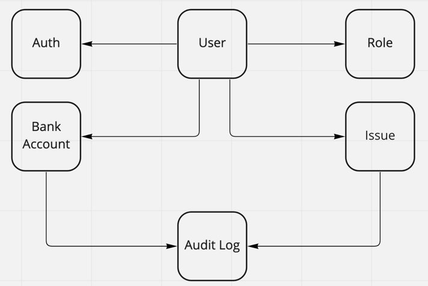
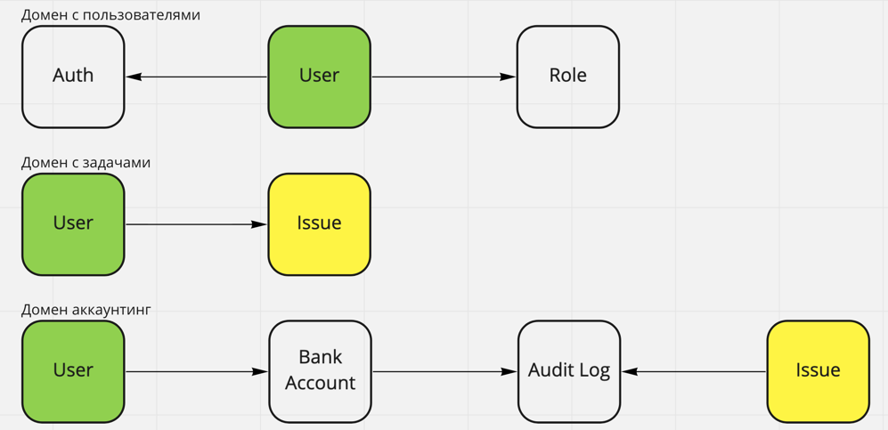

# Разбор требований

Разобрать каждое требование на составляющие (актор, команда, событие, query).
Определить, как все бизнес цепочки будут выглядеть и на какие шаги они будут разбиваться.

### Аутентификация пользователя

- **Actor:** User | Service
- **Command:** Authenticate User
- **Data:** User
- **Event:** Users.Authenticated

### Создание задачи

> Новые таски может создавать кто угодно (администратор, начальник, разработчик, менеджер и любая другая роль).
> У задачи должны быть описание, статус (выполнена или нет) и попуг, на которого заассайнена задача.

- **Actor:** User (any role)
- **Command:** Create Issue
- **Data:**
- **Event:** Issues.Created

### Заассайнить задачи

> Менеджеры или администраторы должны иметь кнопку «заассайнить задачи», которая возьмёт все открытые задачи
> и рандомно заассайнит каждую на любого из сотрудников (кроме менеджера и администратора)

- **Actor:** User (Admin | Manager)
- **Command:** Reassign Issues
- **Data:** Issue
- **Event:** Issues.Reassigned

### Просмотр назначенных задач

> Каждый сотрудник должен иметь возможность видеть в отдельном месте список заассайненных на него задач.

- **Actor:** User
- **Command:** Show My Issues
- **Data:**
- **Event:**

### Отметить задачу выполненной

- **Actor:** User
- **Command:** Complete Issue
- **Data:** Issue
- **Event:** Issues.Completed

### Списать деньги с сотрудника

> Деньги списываются сразу после ассайна на сотрудника.
> Формула, которая говорит сколько списать денег с сотрудника при ассайне задачи — rand(-10..-20)$.

- **Actor:** Event Issues.Reassigned
- **Command:** Deduct money
- **Data:** Issue, User, BankAccount
- **Event:** BankAccounts.Deducted

### Начислить деньги сотруднику

> Деньги начисляются после выполнения задачи.
> Формула, которая говорит сколько начислить денег сотруднику для выполненой задачи — rand(20..40)$.

- **Actor:** Event Issues.Completed
- **Command:** Refill user account
- **Data:** Issue, BankAccount
- **Event:** BankAccounts.Refilled

### Показать количество заработанных топ-менеджментом за сегодня денег

> сумма всех закрытых и заасайненых задач за день с противоположным знаком:
> `(sum(completed task amount) + sum(assigned task fee)) * -1`

- **Actor:** User (Admin | Manager)
- **Command:** Show money earned today
- **Data:** AuditLogs
- **Event:**

### Выплата зарплаты за день

- **Actor:** PaymentWorker
- **Command:** Pay salary for the day
- **Data:** AuditLogs, BankAccount
- **Event:** BankAccounts.Paid

# Модель данных

# Определяем домены

# Сервисы

- сервис аутентификации
- сервис работы с задачами
- сервис аккаунтинга и аналитики
